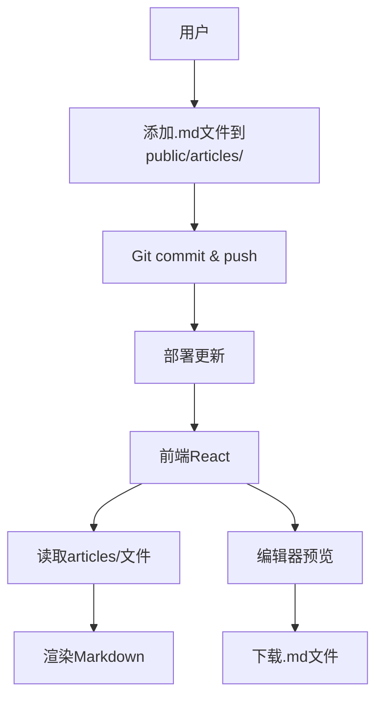

# Markdown文章管理系统架构设计

## 概述
这是一个前端-only的Web应用程序，用于渲染和编辑Markdown文章。文章通过Git仓库管理，用户手动添加.md文件到指定文件夹。前端读取这些文件，渲染Markdown内容，支持实时预览、搜索和导出功能。

## 系统架构

### 前端 (React + TypeScript)
- **框架**: React 19 + Vite
- **样式**: Tailwind CSS
- **Markdown编辑器**: @uiw/react-md-editor (支持实时预览)
- **Markdown渲染**: react-markdown + 插件
  - rehype-highlight (语法高亮)
  - rehype-katex (数学公式)
  - remark-gfm (表格、删除线等)
- **路由**: React Router
- **状态管理**: React Context 或 Zustand
- **文件读取**: 动态导入或fetch从public/articles/
- **导出PDF**: html2canvas + jsPDF

### 文件夹结构
```
LuN3cy-main/
├── public/
│   └── articles/ (存储.md文件)
│       ├── article1.md
│       ├── article2.md
│       └── ...
├── src/
│   ├── components/
│   │   ├── MarkdownEditor.tsx
│   │   ├── MarkdownRenderer.tsx
│   │   └── ...
│   ├── pages/
│   │   ├── ArticlesList.tsx
│   │   ├── ArticleView.tsx
│   │   └── ArticleEdit.tsx
│   ├── hooks/
│   │   └── useArticles.ts
│   └── utils/
│       └── markdownUtils.ts
├── package.json
└── README.md (部署指南)
```

### 文章管理
- **存储**: Markdown文件存储在`public/articles/`文件夹
- **元数据**: 文件名作为ID，内容解析标题、日期等
- **上传**: 用户手动添加.md文件到`public/articles/`，然后git commit/push
- **编辑**: 前端编辑器编辑内容，提供下载.md文件功能，用户手动替换

### 安全考虑
- 前端验证文件类型（仅.md）
- 内容清理（防止XSS，通过react-markdown安全渲染）
- 无后端，无数据库泄露风险

### 部署
- 前端: Vercel/Netlify (静态部署)
- 文章更新: 通过Git push更新

### 功能特性
- ✅ Markdown渲染（语法高亮、数学公式、表格等）
- ✅ 实时预览和编辑
- ✅ 文件上传验证（前端）
- ✅ 响应式设计
- ✅ 搜索功能
- ✅ 导出PDF
- ✅ 本地存储接口（下载文件）

## Mermaid图



```mermaid
sequenceDiagram
    participant U as 用户
    participant G as Git
    participant F as 前端

    U->>G: 添加/编辑.md文件
    U->>G: git add, commit, push
    G->>F: 部署更新
    F->>F: 读取文件列表
    U->>F: 浏览文章
    F-->>U: 渲染Markdown

    U->>F: 编辑文章
    F-->>U: 编辑器界面
    U->>F: 编辑内容
    F-->>U: 实时预览
    U->>F: 下载.md文件
    F-->>U: 下载文件
    U->>G: 替换文件，git push
```</content>
</xai:function_call name="update_todo_list">
<parameter name="todos">[x] 分析当前项目结构和需求\n[x] 设计系统架构（前端-only，使用Git管理文章）\n[ ] 创建articles文件夹和示例文件\n[ ] 扩展前端以支持Markdown编辑和预览\n[ ] 集成Markdown渲染库（react-markdown, rehype-highlight, rehype-katex等）\n[ ] 添加搜索功能\n[ ] 添加导出PDF功能\n[ ] 实现响应式设计\n[ ] 创建部署指南\n[ ] 提供示例数据