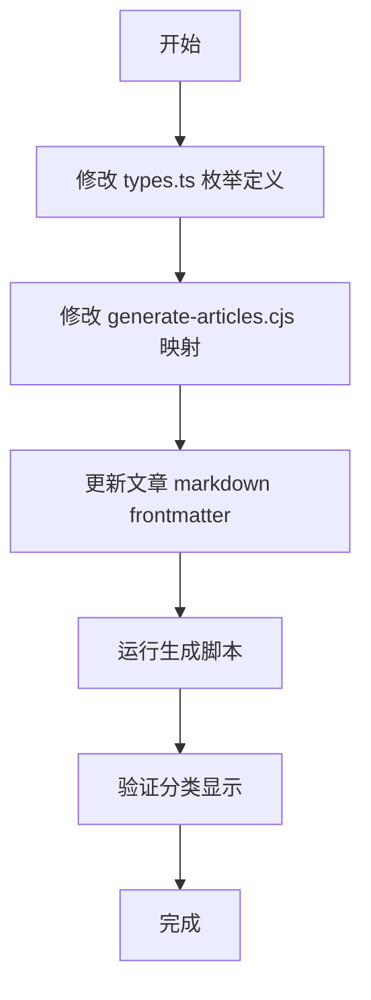

# 文章分类修改计划

## 概述

将文章分类从当前的5个分类（DiT、LUNA、瞎叨be叨、After8、山海疗养院）简化为3个更符合实际内容的分类（Tech、Security、Misc）。

## 当前状态

### 现有分类定义 (`types.ts`)
```typescript
export enum ArticleCategory {
  DIT = 'DiT',        // 数媒与课程
  LUNA = 'LUNA',      // 影像相关
  TALK = '瞎叨be叨',   // 杂记
  AFTER8 = 'After8',  // 聊艺术
  SERENITY = '山海疗养院' // 游记
}
```

### 现有文章及归属
| 文章 | 当前分类 | 新分类 |
|------|----------|--------|
| 安全杂谈-AI篇001：醉语风险与防护 | 瞎叨be叨 | Security |
| 技术解读-AI篇001：claude skills | 瞎叨be叨 | Tech |
| 技术解读-AI篇002：多Agent的风波 | 瞎叨be叨 | Tech |
| 技术解读-AI篇004：当LLM开始睡觉 | 瞎叨be叨 | Tech |
| 实战技术-开发篇001：一切的源头GIT | 瞎叨be叨 | Tech |
| 测试-LaTeX渲染测试 | 瞎叨be叨 | Misc |

---

## 修改计划

### 步骤 1: 修改 `types.ts` 中的 ArticleCategory 枚举

**文件**: [`types.ts`](types.ts:13)

**修改内容**:
```typescript
export enum ArticleCategory {
  TECH = 'Tech',       // 技术
  SECURITY = 'Security', // 安全
  MISC = 'Misc'        // 杂项
}
```

---

### 步骤 2: 修改 `scripts/generate-articles.cjs` 中的 CATEGORY_MAP

**文件**: [`scripts/generate-articles.cjs`](scripts/generate-articles.cjs:20)

**修改内容**:
```javascript
const CATEGORY_MAP = {
  'Tech': 'Tech',
  'Security': 'Security',
  'Misc': 'Misc',
  // Variations (lowercase)
  'tech': 'Tech',
  'security': 'Security',
  'misc': 'Misc'
};

const DEFAULT_CATEGORY = 'Misc';
```

---

### 步骤 3: 更新文章 Markdown 文件的 Frontmatter

需要修改以下文件的 `category` 字段：

1. **安全杂谈-AI篇001：醉语风险与防护（drunk ai）.md**
   - `category: Security`

2. **技术解读-AI篇001：claude skills【一场AI的洪流】.md**
   - `category: Tech`

3. **技术解读-AI篇002：多Agent的风波.md**
   - `category: Tech`

4. **技术解读-AI篇004：当LLM开始睡觉【一种让AI真正记住你的黑科技】.md**
   - `category: Tech`

5. **实战技术-开发篇001：一切的源头"GIT".md**
   - `category: Tech`

6. **测试-LaTeX渲染测试.md**
   - `category: Misc`

---

### 步骤 4: 重新运行生成脚本

执行命令：
```bash
node scripts/generate-articles.cjs
```

这将重新生成 [`src/data/generated_articles.ts`](src/data/generated_articles.ts) 文件。

---

### 步骤 5: 验证

- 检查生成的 `generated_articles.ts` 文件中分类是否正确
- 在前端页面验证分类筛选功能是否正常工作

---

## 文件修改清单

| 文件 | 操作 |
|------|------|
| `types.ts` | 修改 ArticleCategory 枚举 |
| `scripts/generate-articles.cjs` | 修改 CATEGORY_MAP |
| `public/articles/*.md` (6个文件) | 修改 frontmatter category |
| `src/data/generated_articles.ts` | 自动重新生成 |

---

## 流程图


