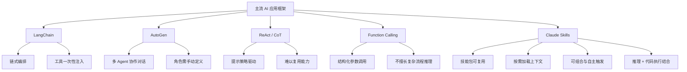

# Markdown示例文章1

这是第一篇示例文章，展示Markdown的各种功能。

## 代码块

这是一个JavaScript代码块：

```javascript
function hello() {
    console.log('Hello, World!');
}
hello();
```

## 数学公式

爱因斯坦的质能方程：$E = mc^2$

或者更复杂的：

$$
\int_{-\infty}^{\infty} e^{-x^2} dx = \sqrt{\pi}

$$




## 表格

| 名称 | 年龄 | 职业   |
| ---- | ---- | ------ |
| 张三 | 25   | 工程师 |
| 李四 | 30   | 设计师 |

## 图片链接


## 列表

- 项目1
- 项目2
  - 子项目

## 引用

> 这是一个引用块。

## 链接

[百度](https://www.baidu.com)
