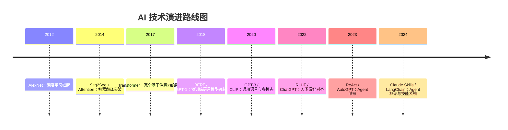
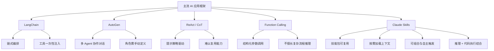

---
tags:
  - 人工智能
  - AI
  - claude
  - 技术解读
  - 博客
  - 公众号
title: 技术解读：claude skills【一场AI的洪流】
date: 2026-01-28
category: Talk
cover: ""
---
# 0x00 问题QA
或许需要通过提出问题的形式来引导开启这个技术解读的篇章，因为本身AI这个领域的发展，在我个人看来是极快的，技术的更新，框架的迭代，不断有新的内容进入，人本身其实是学的飘飘然的，或许是我的学习能力较差😫

Q1：什么是skills技术，概念是什么?
Q2：什么是 Claude Skills？它只是“提示词模板”吗？
Q3：为什么需要 Skills？直接写 prompt 不够吗？
Q4：Claude Skills 和 Agent / Tool Calling 是什么关系？
Q5：Claude Skills 对开发者真正的价值是什么？

Q6：这篇文章会讲些什么？（那么这个问题，在这里就可以进行解答，各位友友，可以提前吃定心丸）
**A6：文章会先快速回顾从 AI 诞生到今天的关键技术演进，借此引出 Skills** 为什么会出现、解决了什么问题；接着把目前主流的 AI 技术、框架与一些代表性设想做一次系统梳理与横向对比，提炼各自的适用场景与边界；最后结合趋势与个人理解，对未来技术路线和行业走向做一个阶段性预测与分析。整体偏“学习总结 + 个人观点”，难免有疏漏，欢迎一起补充讨论。

# 0x01 AI技术的发展历程
## 深度学习时代的重要技术节点回顾
**2012 年 – 深度学习崛起**：卷积神经网络（CNN）在计算机视觉领域取得突破。Alex Krizhevsky 等人在 ImageNet 挑战赛上以 “AlexNet” CNN 模型将识别错误率减半至 **15.3%**，首次将准确率提高到 75% 以上。AlexNet 的成功被誉为 CNN 的“_成人礼_”，因为它充分展示了 GPU 加速训练、ReLU 激活函数、Dropout 正则化等新技术，大幅提升了图像识别效果。这一成果引爆了深度学习热潮，推动业界和学界纷纷投入神经网络研究。

**2014 年 – 序列建模与注意力机制**：循环神经网络（RNN）开始在自然语言处理崭露头角，Seq2Seq（序列到序列）模型用于机器翻译取得成功。同年 Bahdanau 等人提出**注意力机制**，解决 RNN 编码固定长度向量的瓶颈。通过让译文生成的每一步都对原文不同部分“**对齐**”关注，模型可以保留整个输入序列的信息，从而显著提升长文本序列处理性能。注意力机制为后来 Transformer 架构奠定基础。

**2017 年 – Transformer**：谷歌提出 Transformer 模型，实现了_完全基于注意力_的编码器-解码器架构，彻底摆脱了序列计算限制。Transformer 通过多头自注意力并行处理序列，不仅避免了 RNN 长距离梯度消失问题，还能充分利用现代 GPU 并行加速，使得模型扩展到前所未有的规模成为可能。Transformer 成为之后几乎所有自然语言处理（NLP）**预训练模型**的骨干。

**2018–2019 年 – 预训练模型浪潮**：基于 Transformer 的**BERT**模型横空出世。BERT 引入双向预训练策略，通过遮盖词填空任务学习词语的上下文表示，一举刷新了11项NLP基准任务的性能。OpenAI 发布**GPT 系列**：GPT-1 探索生成式预训练，GPT-2 将模型规模扩展至 15 亿参数，展现了惊人的通用文本生成能力。模型参数量与性能呈现“以大制胜”的趋势。2019 年，生成对抗网络（GAN）也取得瞩目进展，但在NLP领域，Transformer-架构的预训练语言模型成为主流。

**2020–2021 年 – 超大模型与多模态**：OpenAI 发布了 **GPT-3**，参数规模骤增到 **1750 亿**。GPT-3 展现出接近人类的语言生成能力和**Few-Shot Learning**（小样本学习）能力，仅给出几条示例就能执行新任务，被视为通用人工智能的重要里程碑。GPT-3 展示了大规模预训练模型强大的泛化能力和灵活性，为后续更先进的模型奠定基础。多模态模型方面，OpenAI 的 **CLIP** 和 **DALL·E** 将图像与文本联合训练，实现了跨模态的理解与生成。**Transformer** 架构也扩展至图像、音频等领域。2021 年，Diffusion（扩散）模型如 **Stable Diffusion** 推出，在图像生成领域取得突破。多模态智能开始融入主流。

**2022 年 – 模型对齐与强化学习反馈**：随着模型能力激增，如何**对齐**模型行为以满足人类意图成为焦点。OpenAI 推出了 **InstructGPT** 和后续的 **ChatGPT**，采用人类反馈强化学习（RLHF）对语言模型进行微调。通过人类对模型输出的偏好打分训练奖励模型，再用策略优化（PPO）调整模型，显著提升了模型回答的有用性、准确性和安全性。ChatGPT 的横空出世让 RLHF 名声大噪——事实证明，RLHF 大幅增强了助手对人类指令的有用性，减少了有害输出，被视为让 AI 真正可用的关键步骤。同年，**知识检索增强（RAG）**、**Prompt 编排** 等技术也兴起，用外部知识库或复杂提示提高模型的可靠性。

**2023 年 – 工具使用与Agent自治**：为弥补纯语言模型在事实获取、计算、操作执行方面的不足，研究者开始让大模型学会**调用工具**。谷歌提出 **ReAct** 提示框架，使模型在思考过程中可以插入动作指令调用搜索、计算等工具，从而交替进行“推理”与“行动”，有效降低了幻觉错误并提高事实准确性。OpenAI 则在 GPT-4 API 中引入**函数调用（Function Calling）** 机制，使模型可以直接返回结构化的函数参数来调用外部API。研究者还提出 **Tree-of-Thoughts**（思维树）等推理方法，通过让模型探索分支解答路径并自我评估，解决以往一步到位不易解决的复杂问题。
	这一年更见证了Agent（自主代理）的早期探索：开源项目 AutoGPT 和 BabyAGI 让 GPT-4 等模型在没有人类干预下循环决策、产生子任务，尝试完成用户的高层目标。这类自主 Agent 能够调用工具、访问互联网、自主生成新指令执行，展示了 **AI 连续自主工作的雏形**。虽然 AutoGPT 等在实践中暴露出易走环、效率低等问题，但它们证明了在一定框架下 LLM 可以执行**长链任务**。与此同时，大模型开始拥有**代码执行**能力（如 ChatGPT 的 Code Interpreter 插件、Anthropic Claude 的代码环境），能够以安全沙盒方式运行代码、读写文件，进一步拓展了 AI 处理问题的手段。
	

**2024–2025 年 – 多智能体协作与认知架构**：跨模型、多智能体协作成为新的研究方向。微软提出 **AutoGen** 框架，支持多个 LLM **代理角色**之间通过对话协作完成复杂任务。社区中，各类 Agent Framework 百花齐放——例如 **LangChain** 提供了方便的模块将 LLM 同搜索、数据库、计算等工具衔接起来，**HuggingGPT** 则协调不同模型各司其职解决多模态任务。这一时期“大模型+工具/脚本”的范式逐步形成：LLM 不再孤军奋战，而是作为**中枢决策大脑**，通过调用外部工具和知识系统来提高可靠性和扩展能力。Anthropic 在 2025 年发布 **Claude 2** 与 **Claude Code**，并引入了重磅的新概念 **Claude Skills**，试图从根本上改进 Agent 的构建方式。

下面梳理一下技术路线演进图：

# 0x02 什么是Claude Skills
你可以把skills理解为一份针对某个工作的规范的工作指南合集，那么这个合集里边就有完成这项工作的说明书，一步一步教你完成这件事。还有老前辈的经验书，可以是会使用到的一些额外工具说明，遇到某种问题的解决方法，对于一些特定类型的问题的思考过程。还可以防止可能使用到的工具，辅助工作的完成。

Skills 在代码执行环境中运行，Claude 具有文件系统访问、bash 命令和代码执行功能。可以这样想：Skills 作为虚拟机上的目录存在，Claude 使用与您在计算机上导航文件相同的 bash 命令与它们交互。

触发 Skill 时，Claude 使用 bash 从文件系统读取 SKILL.md，将其指令带入上下文窗口。如果这些指令引用其他文件（如 FORMS.md 或数据库架构），Claude 也会使用其他 bash 命令读取这些文件。当指令提及可执行脚本时，Claude 通过 bash 运行它们并仅接收输出（脚本代码本身永远不会进入上下文）。

官方给的示例：加载 PDF 处理 skill
以下是 Claude 如何加载和使用 PDF 处理 skill 的方式：

1. **启动**：系统提示包括：`PDF 处理 - 从 PDF 文件中提取文本和表格、填充表单、合并文档`
2. **用户请求**：「从此 PDF 中提取文本并总结」
3. **Claude 调用**：`bash: read pdf-skill/SKILL.md` → 指令加载到上下文中
4. **Claude 确定**：不需要表单填充，因此不读取 FORMS.md
5. **Claude 执行**：使用 SKILL.md 中的指令完成任务

# 0x04 skills原理：一点通

# 0x05 Claude Skills 与主流 AI 框架的比较
随着 AI 应用变得越来越复杂，业界涌现出多种 “LLM + 工具/流程” 框架和思路。其中具有代表性的是：
- **LangChain**：一个用于构建 LLM 应用的开源库，提供了丰富的模块（prompt模板、记忆、检索、工具接口等）来_编排_多个 LLM调用和工具使用。开发者可以用 LangChain 构建**Chain（链式调用）**或 **Agent（智能体）**，让模型按预设逻辑调用外部工具。然而 LangChain 默认需要在代理初始化时**提供所有可能用到的工具列表**，即“把整个工具箱一次性交给模型”。当工具数量很多时，这种方式有明显缺点：模型每次都得在大量不相关的工具中做选择，增加**推理开销**和**出错概率**，也浪费了上下文窗口和调用成本。正如有人比喻的：“就像让人修水龙头时翻阅500页的工具手册——能行但极低效”。因此，LangChain 等框架在复杂场景下可能出现**延迟高、花费大**的问题，需要开发者谨慎设计工具集或借助额外中间件优化。
    
- **函数调用 & 插件**：OpenAI 的函数调用接口以及 ChatGPT 插件生态，为模型接入工具提供了另一种范式。通过**显式的 API 签名**，模型可以在回答时返回预定义函数及参数，从而让外部程序调用对应工具。这种方式的优点是安全、确定性高，适用于结构化任务。但函数调用通常**一次只能执行一个函数**，不擅长处理需要多步决策或动态流程的问题。而 ChatGPT 插件虽然允许模型访问外部服务，但每个插件本质上是**独立 API**，缺乏统一的知识共享机制。同时，过多插件也会占用上下文窗口，对提示设计提出挑战。
    
- **Open Interpreter**：这是开源社区的尝试，允许 LLM（如 GPT-4）充当本地计算机的“解释器”，直接执行用户指定的代码或shell命令。在有限沙盒中，模型可以完成数据分析、文件操作等任务。Open Interpreter 展示了将 LLM 与本地环境结合的可能，但它主要作为一个开发者工具，并没有提供结构化的知识复用体系。
    
- **ReAct / 思维链等提示策略**：这类是_提示工程_层面的框架。ReAct 将模型输出格式约定为交替的“Thought: (思考)”和“Action: (行动)”步骤，使模型可以一边推理一边请求工具使用。它无需特殊外部库，凭借提示模板就实现了让模型**自行决策何时调用何种工具**，开创了LLM Agent的新思路。类似地，思维链（Chain-of-Thought）提高了模型长算术或逻辑题的准确率，Tree-of-Thought 则让模型尝试多种思路并筛选最优解。这些策略提高了单次对话中模型的**推理深度**，但仍然属于“**一次性**”提示，**不具备跨会话的记忆或技能复用**能力。开发者往往需要为每个新任务重新设计提示，无法像软件模块一样随时复用。
    
- **AutoGPT / BabyAGI 等自治 Agent**：这两者在2023年引发热议，体现了_完全自动_的 Agent 设想。它们让模型在没有明确结束条件时反复自行调用自身，从而生成连续行动计划。例如 AutoGPT 会自行生成下一步指令，不断执行直至认为目标达成。虽然概念激动人心，但实践证明此类 Agent **缺乏可靠的规划能力**：容易陷入循环、偏离目标、资源消耗巨大。此外，这些实验性Agent通常**将所有上下文（任务目标、已完成步骤等）每轮重复输入模型**，上下文窗口很快耗尽。同时，它们的“记忆”和“行动”策略硬编码在流程中，**缺乏模块化、可移植的知识库**。
    

以上各种方案各有侧重：有的偏重开发工具集成（LangChain），有的偏重提示技巧（ReAct），有的追求完全自治（AutoGPT）。**Claude Skills 的出现提供了一种与众不同的范式**：它既不像 LangChain 那样主要依赖**框架代码** orchestrate，也不同于 ReAct 等只是**提示套路**。Claude Skills 更像是介于两者之间的一条新路，通过结构化的“技能包”来扩展模型能力，在复用性和动态性上实现了突破。

Q3：Skills 的价值在于把“写得好的 prompt”升级为**可复用、可验证、可维护的能力模块**：它不仅包含提示词，还往往封装了步骤、输入输出约束、错误处理、以及对工具/文件/系统的调用规范，让模型在复杂任务里更稳定、更一致，也便于团队复用和迭代；单纯写 prompt 往往一次性、脆弱，遇到长流程、多工具或边界情况更容易跑偏。Q4：Claude Skills 更像是 **Agent/Tool Calling 的“组织层/能力层”**：Agent/Tool Calling 解决“模型如何调用外部工具并做决策执行”，而 Skills 把这些调用方式与业务流程编排成一套“可直接触发的能力”，相当于把工具调用的策略、流程和最佳实践打包，方便在不同场景被稳定调用与组合。

## 0x06 Claude Skills 引出的范式转变及对开发的影响
Claude Skills 的出现，更像是一道分水岭：它把 AI 应用从“靠灵感堆提示词”的阶段，推向了“像写软件一样组织能力”的阶段。过去我们习惯把提示词当成一次性对话的手工艺品——每次遇到新场景就重新调参、重新措辞、重新试错；而 Skills 把这种“即席提示”的不稳定与不可复用，变成了可以沉淀、可维护、可共享的能力资产。它带来的变化不只是效率提升，更会在开发流程、团队协作和系统架构层面触发连锁反应。

先从最直观的开发流程说起。传统的 Prompt Engineering 往往是一种“反复打磨单轮提示”的工作：为了让模型输出更稳定，你不断加约束、加示例、加格式要求，直到它看起来“差不多能用”。可这种提示的复用性很弱，换个任务、换个上下文、换个团队成员，就得重新来一遍。Skills 的思路恰好相反：与其把时间耗在一次性提示的微调上，不如把复杂 prompt 打造成可长期使用的“技能包”。它更像传统软件工程里的模块封装：你把输入输出、边界条件、失败处理方式都梳理清楚，形成一套稳定的能力接口。这样当系统再次需要同类能力时，不再从头提示，而是直接调用技能，让“经验”变成真正可累积的生产力。很多团队的 AI 交互时间都消耗在重复调提示上，Skills 的意义就在于把这种时间从“重复劳动”中解放出来，让知识可以复利式增长。

更深一层的是开发者思维方式的变化。以前提示词有点像“咒语”：它有效，但难以解释为什么有效，也难以传递给别人。技能化之后，提示不再是黑箱技巧，而是有结构、有文档、可版本化的显性资产——它可以被评审、被测试、被共享，也可以被迭代更新。你开始用一种更工程化的方式去问自己：系统需要哪些核心能力？这些能力之间的边界在哪里？哪些是通用能力可以沉淀成库？哪些是业务特有能力需要权限隔离？这会把 AI 开发从“灵感驱动的提示拼贴”，推向“可维护的能力工程”。在团队协作里尤其明显：新人不需要从口耳相传的提示技巧开始摸索，只要理解技能说明，就能快速接入同一套能力体系。提示从个人手艺，变成团队资产，这才是规模化开发真正需要的东西。

当 Skills 成为第一等公民，系统架构也会被迫重画分层。以往典型的 LLM 应用要么是“LLM + 工具 API”的平铺流程，要么是在业务代码里散落着大量 prompt 字符串，逻辑分散且难以治理。Skills 相当于在基础模型与具体应用之间新增了一层抽象：一种介于“模型能力”和“业务流程”之间的认知层。你不再只是在写 API 调用，而是在编排模型的中间思考步骤——哪些信息该被检索、该如何总结、该如何验证、如何在不确定时回退、如何给出可审计的结构化产出。某种意义上，我们开始接近“面向认知过程的编程”：把认知拆成模块，把推理当作流程，把决策当作可控的系统行为，而不是寄希望于一段巨型 prompt 一次性把所有事情做对。

这也解释了为什么 Skills 天然适合组合式 Agent。面对复杂任务时，最理想的形态往往不是“一个超级提示词”，而是一组互补的智能子过程：有的负责信息检索，有的负责抽象归纳，有的负责计划拆解，有的负责验证纠错。Skills 让这种组合变得自然：模型像一个调度者，根据任务阶段调用不同技能，让系统的扩展方式从“把提示越写越长”，变成“把能力越拼越强”。同时，技能往往还能结合权限控制、工具白名单与沙盒执行等机制，把能力边界写死在系统层面，而不是靠提示里一句“请不要做某事”来碰运气。这对于构建更大规模、更可控的 Agent 系统非常关键：安全与可靠性不再只是内容层的约束，而是架构层的设计。

最后一个值得注意的方向，是它对 AI 产品与生态的潜在推动。技能能够把某领域的流程规范、经验诀窍、最佳实践打包成可交付的能力单元，那么“知识”就不再只是文档或培训，而可能直接以技能的形式流通：企业把内部流程固化为私有技能，形成效率壁垒；个人开发者把自己最擅长的工作流做成技能包，像插件一样被订阅和复用；甚至不同平台之间出现技能规范与互通的可能性。这样一来，价值不再只由底层模型的参数规模决定，还取决于模型可调用的高价值技能库——一种“AI 知识即服务”的雏形会越来越清晰，Agent 经济也会从概念走向实际形态。

总结来看，Claude Skills 引领的变化，并不只是把 prompt “封装起来”这么简单，而是在把 AI 开发推向一种更工程化、也更认知化的路线：既更接近传统软件工程的可维护性与协作范式，又进一步触及“如何编排思考”的新课题。未来开发者要掌握的能力，可能不仅是写代码、调提示，而是学会设计技能、组织技能、调度技能，并且面对模型的不确定性建立验证、监控与回退机制——把“会想”变成“可控地想”，把“能用”变成“可规模化地用”。这会是挑战，但也会是 AI 时代最具含金量的机会之一。

## 0x07 面向未来的趋势展望
Claude Skills 像是一面“技术风向标”，把我们从一个很具体的产品形态（技能库、技能触发、权限与沙盒）引向更宏观的判断：通用智能正在从“能对话”走向“能做事”，而“能做事”的关键不只在于模型更大、更强，更在于能力如何被组织、被调度、被验证、被规模化复用。未来几年，AI 技术版图大概率会沿着几条主线同时推进：智能形态变得更像团队协作，开发方式更像工程编排，而 AI 在生活与工作中的角色也会从“助手”进一步演化为“伙伴、员工与操作员”。

先看大模型智能自身的演化。我们很可能会看到一个显著趋势：模型能力的增长不再完全等同于参数规模的增长，而更多体现在“推理质量”和“协作效率”的提升上。单体模型会继续增强规划与推理能力，但它的进化路径可能更像“从直觉回答”走向“可追踪的多步推理”。围绕思维链（Chain-of-Thought）和搜索式推理（例如 Tree-of-Thoughts 这类思路）的研究，会推动模型在输出之前先探索多条路径、做自我比较、进行一致性检查，从而把“看起来很聪明但偶尔乱编”的不稳定性压下去，让可靠性变成可以工程化追求的指标。也就是说，未来的关键不只是让模型更会答，而是让模型更会“验证自己答得对不对”。

与此同时，“一个模型挑大梁”的范式也会逐渐松动，取而代之的是更具工程可控性的多智能体协作。我们已经在 AutoGen 这类框架里看到雏形：同一个系统里可以同时存在规划者、执行者、审计者、反驳者、检索者，它们彼此分工、互相监督，让整体表现更接近人类团队。Claude Skills 在这里其实提供了一个很自然的拼装接口：技能可以被看作“虚拟专家”，当模型按需触发不同技能时，本质上就是在调用不同能力组件来完成协同。这种分工协作的价值在于，它把复杂问题拆成多个可控子过程，既能提升成功率，也能让错误定位更清晰——你能知道偏差发生在哪个环节、由哪个能力导致，而不是面对一个巨型 prompt 的“整体失效”束手无策。

多模态融合则会把这条路线推得更远。今天我们已经看到模型能处理图文、能理解语音，下一步更像是把视觉、听觉、语言乃至动作（操作系统/工具行为）统一到同一套推理框架里，让 AI 不再局限于文本输入输出，而是能“边看、边听、边做”。一旦 AI 能够从视频流里理解环境、从语音里解析意图、再调用工具去执行任务，它就会从聊天机器人跃迁为真正意义的行动型智能体。不过，多模态带来的信息密度更高、噪声更多，这反而要求更强的“动态上下文管理”和“按需调用机制”——也就是类似 Skills 的渐进披露：只有在相关时才调动对应模态技能，避免无意义的干扰，让系统在复杂感知中依然保持条理。

如果说智能形态在走向“团队化”，那么开发范式则在走向“编排化”。Prompt 编程在过去两年极其有效，但它很可能不是终点，而只是早期的过渡形态。技能编排（Skill Orchestration）会逐渐成为主流：开发者不再把主要精力放在“把这句提示词怎么写更像人话”，而是放在“需要哪些技能、这些技能怎么组合、在什么条件下触发、怎样回退与校验”。这很像软件工程从手写汇编走向高级语言与库生态的过程：你仍然需要理解底层原理，但日常工作更多是在更高抽象层上构建系统。未来也许会出现更成熟的“编排语言”或“编排框架”，用接近声明式的方式描述智能体行为：当用户请求 X 时，先调用 A 获取信息，再并行调用 B/C 做分析，最后用 D 汇总并生成可审计结果。你写的不再是提示词，而更像一份对 AI 行为的流程定义。

这会让 AI 软件的生命周期也发生变化。调试不再是逐行排查代码，而是观察“技能调用链”和“决策轨迹”：模型为什么选择了这个技能而不是那个？在哪一步开始偏离？是否缺少关键上下文？是否某个技能输出不稳定？于是新的工具链会变得重要：认知调试器、流程可视化监控、行为测试框架、技能版本管理与灰度发布，这些听起来像传统工程里的 DevOps，但对象变成了“认知过程”本身。换句话说，我们会进入一个时代：AI 系统的可维护性不再靠写更长的 prompt，而靠更成熟的能力治理与编排基础设施。

当能力被模块化并可复用，AI 对生活与工作的渗透也会更彻底——它不再只是一个“问答工具”，而会逐渐长出更具体的社会角色。面向个人，它更像 AI 伙伴：具备持续记忆与更强的情感交互能力，能在不同场景切换不同“技能人格”，从学习教练到健康管理，从情绪陪伴到旅行规划，甚至能根据你长期的偏好做出更贴近你的建议。这里 Skills 的意义尤其直接：个性化不是“每次都告诉它你是谁”，而是把你的习惯沉淀成稳定技能，让 AI 在未来的交互中自然延续。

面向组织，它更像 AI 员工：在营销、客服、研发、法务、运营等岗位上承担大量标准化知识工作，并且通过企业技能库遵守品牌语调、合规规则与流程规范。企业会更关心的不是“模型会不会写文案”，而是“这位 AI 员工能不能始终按公司规则办事、能不能被审计、能不能在不同团队复用”。技能化恰好让“行为一致性”成为可管理的事情：同一套技能包可以像制度一样被分发、更新、回滚，AI 的能力与边界由此变得清晰。

再往前一步，则是 AI 操作员：它不只回答你怎么做，而是直接替你做。你给出高层意图——整理文件、批量处理照片、比价下单、生成报告、跨应用搬运信息——AI 负责在系统和软件之间穿梭执行，把一串繁琐操作折叠成一次自然语言指令。这个愿景之所以现实，是因为技能让 AI 可以掌握“如何使用工具”的具体方法：不同软件、不同流程都可以被封装为技能，进而让“操作电脑/手机”成为 AI 的一种通用劳动能力。对普通人来说，这意味着技术门槛会进一步下降：不会用复杂软件不再是问题，因为你只需要会表达目标。

当然，这一切并不只有光明面。AI 伙伴带来依赖与伦理议题，AI 员工带来组织结构与岗位边界的重塑，AI 操作员带来安全与权限治理的挑战：谁授权它做什么？如何防止误操作？如何追责与审计？但从趋势本身看，主线已经很清楚：AI 会变得更强（推理更可靠）、更抽象（开发更偏编排）、更深入（角色更像参与者）。Claude Skills 所代表的创新，正是这条主线的缩影——把能力做成可复用的模块，把决策做成可组织的流程，把智能做成能落地的系统。

展望未来，我们也许正在接近一种新的通用智能路径：不是让模型“无所不能”，而是让它像人一样通过习得、积累与调用技能来成长；不是追求一次性完美回答，而是构建一套可协作、可验证、可迭代的智能体系。当技能编排成为常态，人类与 AI 的关系也会更像“协作共生”：AI 释放我们的心力，让我们把更多时间投入创造性、判断力与真正属于人的部分。而这，可能才是所谓“实用化通用智能”最重要的标志。
