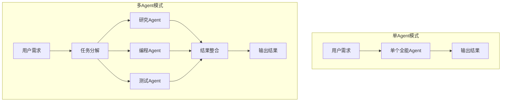
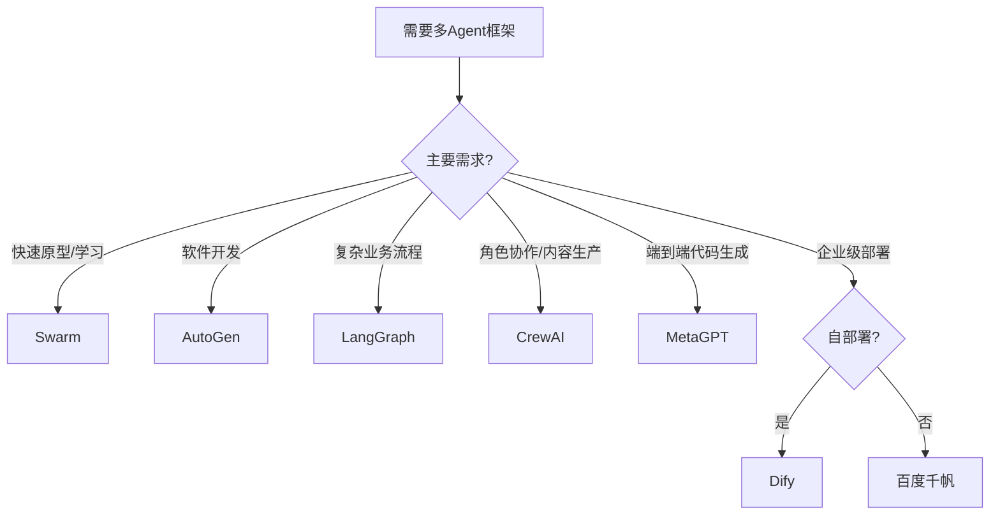

[toc]

## 0x00 背景

你刷着技术新闻，看着各种"智能体""AI Agent"的概念满天飞。

某天产品经理跑来跟你说：我们需要做一个多Agent协同的客服系统。你打开GitHub搜索"multi-agent"，跳出几十个框架：AutoGen、LangGraph、CrewAI、Swarm、MetaGPT...

哪一个才适合你的项目？

这个问题困扰着不少开发者。多Agent框架是2024-2025年AI领域最火的方向之一，大大小小的框架如雨后春笋般冒出来。有的来自大厂，有的来自学术团队，有的是个人项目。

今天我帮你梳理一下这个领域的主流框架，国内外都覆盖到，最后选两个做实操测试，让你知道这些框架用起来是什么感觉。

## 0x01 多Agent框架是什么

在进入框架对比之前，先搞清楚一个问题：什么是多Agent框架，它解决了什么问题？

单个大模型像是一个全才，但不是专才。让它写代码、查资料、画图表，它都能做，但每一样都做不深。

多Agent的核心思路是：分工。

就像一家软件公司，有产品经理写需求、架构师设计系统、工程师写代码、测试做验收。多Agent框架就是让不同的AI扮演不同的角色，各自做擅长的事，协同完成任务。



这看起来很美好，但实现起来要解决很多问题：任务怎么分解？Agent之间怎么通信？谁来做调度？状态怎么管理？

多Agent框架就是帮你解决这些问题的基础设施。

## 0x02 国外主流框架

### 0x02.1 Microsoft AutoGen


图1：AutoGen GitHub项目页面。微软官方维护的agentic AI框架，拥有54.5k+ stars。

**核心特点：**

| 特性     | 说明                                  |
| -------- | ------------------------------------- |
| 对话机制 | Agent之间通过自然语言对话协作         |
| 人机协作 | 支持Human-in-the-loop，人可以参与对话 |
| 代码执行 | 内置Docker沙箱，可安全执行代码        |
| 可视化   | AutoGen Studio提供可视化开发界面      |

**代码示例：**

```python
from autogen_agentchat.agents import AssistantAgent
from autogen_ext.models.openai import OpenAIChatCompletionClient

# 创建一个数学专家Agent
model_client = OpenAIChatCompletionClient(model="gpt-4o")
math_agent = AssistantAgent(
    "math_expert",
    model_client=model_client,
    system_message="You are a math expert. Solve problems step by step."
)

# 运行任务
response = await math_agent.run(task="What is 15 * 23?")
print(response)
```

**优点：**

- 上手快，十几行代码就能跑起来
- 对话式交互自然，适合多轮任务
- 社区活跃，文档完善

**缺点：**

- 状态持久化较弱，长流程容易"失忆"
- 复杂场景下架构容易混乱

**适用场景：** 快速原型开发、软件开发任务、需要人机协作的场景

---

### 0x02.2 LangGraph (LangChain)

**背景：** LangChain团队出品，专门为构建有状态的多Agent应用设计。官方文档：https://langchain-ai.github.io/langgraph/

**核心特点：**

| 特性       | 说明                                |
| ---------- | ----------------------------------- |
| 状态管理   | 内置MessagesState，支持复杂状态流转 |
| 精细控制   | 基于图结构的编排，对流程有精确控制  |
| 可视化调试 | 支持生成架构图，便于调试            |
| 工具集成   | 无缝集成LangChain生态的工具         |

**代码示例：**

```python
from langgraph.graph import StateGraph, MessagesState, END
from langgraph.prebuilt import create_react_agent
from langchain_anthropic import ChatAnthropic

# 创建研究Agent
research_agent = create_react_agent(
    llm=ChatAnthropic(model="claude-3-5-sonnet"),
    tools=[tavily_search],
    prompt="You are a researcher. Find information and share it."
)

# 创建图表生成Agent
chart_agent = create_react_agent(
    llm=ChatAnthropic(model="claude-3-5-sonnet"),
    tools=[python_repl],
    prompt="You create charts from data."
)

# 构建协作图
workflow = StateGraph(MessagesState)
workflow.add_node("researcher", research_node)
workflow.add_node("chart_gen", chart_node)
workflow.add_edge("researcher", "chart_gen")
workflow.add_edge("chart_gen", END)

app = workflow.compile()
```

**优点：**

- 工作流控制精细，适合复杂业务流程
- 状态管理能力强，不容易丢状态
- 可视化调试友好

**缺点：**

- 学习曲线陡峭，概念多
- 代码量相对较大

**适用场景：** 复杂业务流程、需要精确控制Agent交互、生产级应用

---

### 0x02.3 CrewAI

**背景：** 专注团队协作的开源框架，强调角色扮演和任务分配。官网：https://www.crewai.com

**核心特点：**

| 特性     | 说明                                   |
| -------- | -------------------------------------- |
| 角色导向 | 每个Agent有明确的role、goal、backstory |
| 任务链   | 支持串行任务依赖关系                   |
| 工具集成 | 内置常用工具，支持自定义工具           |
| 进度追踪 | 内置回调机制，可追踪执行进度           |

**代码示例：**

```python
from crewai import Agent, Task, Crew

# 定义Agent
researcher = Agent(
    role="高级研究员",
    goal="深入挖掘AI技术趋势",
    backstory="你是一位经验丰富的技术分析师，擅长发现前沿动态",
    tools=[search_tool],
    verbose=True
)

writer = Agent(
    role="技术写作专家",
    goal="将研究发现转化为清晰易懂的文章",
    backstory="你擅长将复杂技术概念用通俗语言表达",
    verbose=True
)

# 定义任务
research_task = Task(
    description="研究2025年多Agent框架的发展趋势",
    expected_output="一份包含框架对比的技术报告",
    agent=researcher
)

write_task = Task(
    description="基于研究报告撰写技术博客",
    expected_output="一篇2000字的技术解读文章",
    agent=writer
)

# 组建团队
crew = Crew(
    agents=[researcher, writer],
    tasks=[research_task, write_task],
    verbose=True
)

result = crew.kickoff()
```

**优点：**

- 配置简单，上手容易
- 角色概念清晰，符合团队协作直觉
- 代码可读性好

**缺点：**

- 复杂编排能力不如LangGraph
- 状态管理相对简单

**适用场景：** 内容生产、数据加工、明确的角色分工任务

---

### 0x02.4 OpenAI Swarm


**背景：** OpenAI解决方案团队出品，定位为"教育性框架"，20.9k stars。GitHub：https://github.com/openai/swarm

**注意：** OpenAI已宣布Swarm被**OpenAI Agents SDK**取代，建议生产环境使用新的SDK。

**核心特点：**

| 特性   | 说明                                     |
| ------ | ---------------------------------------- |
| 轻量级 | 核心只有两个概念：Agent和Handoff         |
| 无状态 | 完全基于Chat Completions API，不存储状态 |
| 易测试 | 逻辑简单，易于单元测试                   |

**代码示例：**

```python
from swarm import Swarm, Agent

client = Swarm()

def transfer_to_sales():
    return sales_agent

def transfer_to_support():
    return support_agent

# 定义客服Agent
triage_agent = Agent(
    name="客服分派员",
    instructions="判断用户需求，分派给对应部门。",
    functions=[transfer_to_sales, transfer_to_support]
)

sales_agent = Agent(
    name="销售专员",
    instructions="你负责产品销售相关咨询"
)

support_agent = Agent(
    name="技术支持",
    instructions="你负责技术问题解答"
)

response = client.run(
    agent=triage_agent,
    messages=[{"role": "user", "content": "我想了解一下产品价格"}]
)
```

**注意：** OpenAI已宣布Swarm被**OpenAI Agents SDK**取代，建议生产环境使用新的SDK。

**优点：**

- 极简设计，易于理解
- 学习曲线平缓
- 适合教育用途

**缺点：**

- 功能简单，复杂场景需要自己扩展
- 已被官方标记为实验性质

**适用场景：** 学习多Agent概念、简单应用、快速验证想法

---

### 0x02.5 MetaGPT


**背景：** 国人开发的明星项目，64.1k stars，核心思想是"模拟软件公司"。GitHub：https://github.com/geekan/MetaGPT

**核心特点：**

| 特性     | 说明                                  |
| -------- | ------------------------------------- |
| 公司模拟 | 内置PM、架构师、工程师、QA等角色      |
| SOP驱动  | 将软件流程标准化为SOP，Agent按SOP协作 |
| 文档生成 | 自动生成用户故事、API文档、数据结构等 |
| 代码生成 | 可生成可运行的完整项目代码            |

**使用方式：**

```bash
# CLI方式
metagpt "创建一个贪吃蛇游戏"

# 输出：在./workspace生成完整项目
```

```python
# Python库方式
from metagpt.software_company import generate_repo

repo = generate_repo("创建一个贪吃蛇游戏")
print(repo)  # 打印项目结构和文件
```

**优点：**

- 端到端能力，从需求到代码
- 角色分工完整，接近真实开发流程
- 国人开发，中文支持好

**缺点：**

- 定制化程度有限，适合特定场景
- 生成的代码质量依赖模型能力

**适用场景：** 快速原型验证、小型项目生成、学习软件工程流程

---

### 0x02.6 其他框架简述

| 框架              | 特点                          | Stars | 适用场景         |
| ----------------- | ----------------------------- | ----- | ---------------- |
| LlamaIndex Agents | 侧重RAG和文档处理             | -     | 知识库密集型应用 |
| CAMEL-AI          | 学术研究导向，首个多Agent框架 | -     | 研究和教育       |
| Agno              | 号称比LangGraph快500-5000倍   | 18.7k | 高性能需求       |
| Semantic Kernel   | 微软企业级框架，与AutoGen融合 | -     | 企业级集成       |

## 0x03 国内主流框架

### 0x03.1 百度千帆 AppBuilder

**背景：** 百度千帆平台的企业级Agent开发平台，已服务46万+企业，平台Agent数量130万+。

**核心能力：**

| 能力         | 说明                           |
| ------------ | ------------------------------ |
| 多Agent协同  | 支持多智能体协作开发           |
| 工具服务     | 工具组件日均调用量超千万次     |
| 企业级Infra  | 从模型服务到运行环境全栈支持   |
| DeepResearch | 登顶权威评测榜单的深度研究能力 |

**特点：**

- 面向企业客户，提供完整的基础设施
- 支撑智能硬件、制造、交通、能源等行业
- 在深度研究应用场景表现突出

**适用场景：** 企业级Agent应用、需要稳定基础设施支持

---

### 0x03.2 Dify


**背景：** 开源的LLM应用开发平台，支持构建AI Agent和Agentic Workflow。GitHub：https://github.com/langgenius/dify

**核心能力：**

| 能力        | 说明                 |
| ----------- | -------------------- |
| 可视化编排  | 拖拽式工作流设计     |
| 多Agent支持 | 支持多智能体协作模式 |
| 模型集成    | 支持多家模型厂商API  |
| RAG集成     | 内置检索增强生成能力 |

**特点：**

- 开源免费，可自部署
- 支持工作流和Agent两种模式
- 社区活跃，中文文档完善

**适用场景：** 中小企业、个人开发者、需要自部署的场景

---

### 0x03.3 FastGPT

**背景：** 企业级AI Agent构建平台，主打知识库Q&A。官网：https://fastgpt.io

**核心能力：**

| 能力       | 说明                       |
| ---------- | -------------------------- |
| 知识库训练 | 强大的文档处理和向量化能力 |
| 工作流编排 | 可视化流程设计             |
| RAG+Agent  | 结合检索增强生成和多Agent  |

**特点：**

- 知识库能力突出
- 提供开箱即用的Agent工具包
- 中文文档完善

**适用场景：** 知识库问答、企业知识管理

---

### 0x03.4 AgentVerse


**背景：** 清华大学、北京邮电大学、腾讯联合开发的开源框架，1.1k+ stars。GitHub：https://github.com/Peiiii/AgentVerse

**核心特点：**

| 特性     | 说明                       |
| -------- | -------------------------- |
| 协作对话 | 支持多AI智能体自主交流协作 |
| 灵活配置 | 可动态调整群体组成         |
| 简单易用 | 几行配置即可实现复杂协作   |

**框架组成：**

1. 专家招募 - 动态选择合适的Agent
2. 协作决策 - Agent间讨论达成共识
3. 行动执行 - 执行决策结果
4. 评估反馈 - 评估结果并优化

**适用场景：** 复杂问题求解、多角度专业分析、社会实验模拟

---

### 0x03.5 国内平台对比总结

| 平台       | 类型      | 核心优势                 | 适用对象         |
| ---------- | --------- | ------------------------ | ---------------- |
| 百度千帆   | 商业平台  | 企业级基础设施、行业方案 | 大中型企业       |
| Dify       | 开源框架  | 可自部署、可视化编排     | 开发者、中小企业 |
| FastGPT    | 商业+开源 | 知识库能力强             | 知识管理场景     |
| AgentVerse | 开源框架  | 协作机制灵活             | 研究、教育       |

## 0x04 框架横向对比

### 0x04.1 核心维度对比

| 维度                 | AutoGen | LangGraph | CrewAI | Swarm    | MetaGPT  |
| -------------------- | ------- | --------- | ------ | -------- | -------- |
| **学习难度**   | 低      | 高        | 中     | 极低     | 中       |
| **控制精细度** | 中      | 高        | 中     | 低       | 中       |
| **状态管理**   | 弱      | 强        | 中     | 无       | 中       |
| **社区规模**   | 54.5k⭐ | 15k⭐     | -      | 20.9k⭐  | 64.1k⭐  |
| **上手速度**   | 快      | 慢        | 快     | 极快     | 快       |
| **生产可用**   | 是      | 是        | 是     | 否(教育) | 部分场景 |
| **中文支持**   | 中      | 中        | 中     | 低       | 高       |

### 0x04.2 选型决策树



### 0x04.3 实际选型建议

**如果你是个人开发者/创业者：**

- 优先选 **CrewAI** 或 **AutoGen**，上手快、社区活跃
- 想学概念先玩 **Swarm**
- 中文场景考虑 **Dify** 或 **MetaGPT**

**如果你是创业公司在做产品：**

- 复杂工作流选 **LangGraph**，虽然难但可控
- 快速验证选 **CrewAI** 或 **AutoGen**

**如果你是大企业：**

- 自建能力选 **LangGraph** + **LangSmith**
- 买服务选 **百度千帆** 或 **CrewAI AMP**

## 0x05 实操测试：CrewAI + AutoGen

选两个框架做实际测试，让你感受一下它们用起来是什么感觉。

### 0x05.1 测试场景

做一个"技术趋势分析师"Agent系统：

- 研究员：搜索技术资料
- 分析师：总结趋势和观点
- 写作：生成报告

### 0x05.2 CrewAI 实现

```python
# 安装：pip install crewai crewai-tools langchain-openai

import os
from crewai import Agent, Task, Crew, Process
from crewai_tools import SerperDevTool

os.environ["OPENAI_API_KEY"] = "your-api-key"
os.environ["SERPER_API_KEY"] = "your-serper-key"

# 初始化搜索工具
search_tool = SerperDevTool()

# Agent 1: 研究员
researcher = Agent(
    role="技术研究员",
    goal="收集2025年多Agent框架的最新信息",
    backstory="""你是一位经验丰富的技术研究员，擅长发现前沿动态。
    你知道如何从海量信息中提炼有价值的洞察。""",
    tools=[search_tool],
    verbose=True,
    allow_delegation=False
)

# Agent 2: 分析师
analyst = Agent(
    role="技术分析师",
    goal="分析多Agent框架的技术趋势和发展方向",
    backstory="""你是一位资深技术分析师，擅长从复杂信息中提炼趋势。
    你能看透技术表象，洞察本质。""",
    verbose=True,
    allow_delegation=False
)

# Agent 3: 写作
writer = Agent(
    role="技术写作专家",
    goal="将分析结果转化为清晰易懂的技术报告",
    backstory="""你擅长将复杂技术概念用通俗语言表达。
    你的写作风格专业但不晦涩，适合技术从业者阅读。""",
    verbose=True,
    allow_delegation=False
)

# 任务定义
research_task = Task(
    description="""搜索并研究2025年多Agent框架的发展现状，包括：
    1. 主流框架有哪些新进展
    2. 技术趋势是什么
    3. 有哪些突破性创新
    请提供详细的研究笔记，包含具体的数据和事实。""",
    expected_output="一份包含框架对比、技术分析的研究笔记，约1000字",
    agent=researcher
)

analysis_task = Task(
    description="""基于研究员的笔记，分析多Agent框架的发展趋势：
    1. 技术演进方向
    2. 行业应用热点
    3. 未来预测
    请给出有数据支撑的分析结论。""",
    expected_output="一份趋势分析报告，约800字",
    agent=analyst,
    context=[research_task]
)

write_task = Task(
    description="""基于研究和分析，撰写一篇完整的技术趋势报告。
    要求：结构清晰、观点明确、数据准确、可读性强。""",
    expected_output="一篇2000字左右的技术趋势报告",
    agent=writer,
    context=[research_task, analysis_task]
)

# 创建团队并执行
crew = Crew(
    agents=[researcher, analyst, writer],
    tasks=[research_task, analysis_task, write_task],
    process=Process.sequential,  # 串行执行
    verbose=True
)

# 执行
result = crew.kickoff()
print("\n===== 最终报告 =====")
print(result)
```

**执行效果：**

```
[2025-02-11 10:30:01] Starting crew execution...
[2025-02-11 10:30:02] Task: 技术研究员 is starting...
[2025-02-11 10:30:15] Task: 技术研究员 is completed!
[2025-02-11 10:30:16] Task: 技术分析师 is starting...
[2025-02-11 10:30:28] Task: 技术分析师 is completed!
[2025-02-11 10:30:29] Task: 技术写作专家 is starting...
[2025-02-11 10:30:45] Task: 技术写作专家 is completed!

===== 最终报告 =====
# 2025年多Agent框架技术趋势报告

## 一、发展现状

2025年，多Agent框架领域呈现...

[报告内容约2000字]
```

**体验总结：**

- ✅ 代码结构清晰，易于理解
- ✅ 任务依赖关系自动处理
- ✅ 每个Agent的职责明确
- ⚠️ 耗时较长（3个Agent串行执行约45秒）
- ⚠️ API调用成本较高

---

### 0x05.3 AutoGen 实现

```python
# 安装：pip install -U "autogen-agentchat" "autogen-ext[openai]"

import asyncio
from autogen_agentchat.agents import AssistantAgent
from autogen_agentchat.teams import RoundRobinGroupChat
from autogen_agentchat.ui import Console
from autogen_ext.models.openai import OpenAIChatCompletionClient
from autogen_ext.tools.mcp import McpWorkbench, StdioServerParams

async def main():
    # 初始化模型客户端
    model_client = OpenAIChatCompletionClient(model="gpt-4o")

    # Agent 1: 研究员
    researcher = AssistantAgent(
        name="研究员",
        model_client=model_client,
        system_message="""你是一位技术研究员。
        你的职责是收集和整理2025年多Agent框架的发展信息。
        搜索后提供具体的事实和数据，不要添加主观评论。"""
    )

    # Agent 2: 分析师
    analyst = AssistantAgent(
        name="分析师",
        model_client=model_client,
        system_message="""你是一位技术分析师。
        基于研究员提供的信息，分析技术趋势和发展方向。
        给出有数据支撑的分析结论。"""
    )

    # Agent 3: 写作
    writer = AssistantAgent(
        name="写作",
        model_client=model_client,
        system_message="""你是一位技术写作专家。
        基于研究和分析，撰写一篇完整的技术趋势报告。
        报告要求：结构清晰、观点明确、数据准确、可读性强。
        完成后在回复末尾加上 'TERMINATE'。"""
    )

    # 创建团队
    team = RoundRobinGroupChat(
        participants=[researcher, analyst, writer],
        max_turns=15  # 最多15轮对话
    )

    # 任务
    task = """
    请协作完成一份"2025年多Agent框架技术趋势报告"：

    第一步：研究员搜索并整理主流框架的发展现状
    第二步：分析师分析技术趋势和未来方向
    第三步：写作撰写完整报告

    开始吧！
    """

    # 执行并流式输出
    await Console(team.run_stream(task=task))

    await model_client.close()

if __name__ == "__main__":
    asyncio.run(main())
```

**执行效果：**

```
[研究员]: 我开始搜索2025年多Agent框架的最新信息...
根据搜索结果，主要框架包括AutoGen、LangGraph、CrewAI等...
(提供详细研究笔记)

[分析师]: 基于研究员的信息，我分析出以下趋势...
1. 技术演进方向...
2. 行业应用热点...
(提供分析结论)

[写作]: 我将基于以上信息撰写报告...
# 2025年多Agent框架技术趋势报告
(完整报告内容)
TERMINATE
```

**体验总结：**

- ✅ 对话式交互更自然
- ✅ Agent可以相互讨论，质量可能更高
- ✅ RoundRobin模式简单有效
- ⚠️ 对话可能陷入循环
- ⚠️ 终止条件需要精心设计

---

### 0x05.4 两框架对比

| 维度                 | CrewAI               | AutoGen              |
| -------------------- | -------------------- | -------------------- |
| **代码结构**   | 任务驱动，结构清晰   | 对话驱动，更灵活     |
| **执行方式**   | 串行任务链           | 轮流对话             |
| **上下文传递** | 通过context参数      | 通过对话历史         |
| **可观测性**   | 每个任务有明确输出   | 对话过程可追踪       |
| **适用风格**   | 喜欢明确流程的开发者 | 喜欢对话交互的开发者 |

## 0x06 框架发展趋势

### 0x06.1 技术演进方向

**1. 从对话到工作流**

早期框架（如AutoGen）强调对话式交互，新一代框架（如LangGraph）更强调工作流的精确控制。趋势是两者结合：对话的灵活性 + 工作流的可控性。

**2. 性能优化成为重点**

Agno宣称比LangGraph快500-5000倍，说明性能开始受到重视。未来会有更多针对吞吐量和延迟的优化。

**3. 可观测性增强**

生产环境需要监控、追踪、调试。LangSmith、CrewAI的tracing功能都是这个方向的体现。

**4. 标准化协议**

MCP（Model Context Protocol）等协议的出现，让不同框架的工具可以互通，避免重复造轮子。

### 0x06.2 2025年可能的变化

| 趋势       | 说明                                                     |
| ---------- | -------------------------------------------------------- |
| 框架整合   | 大厂框架可能兼并小框架（如AutoGen与Semantic Kernel融合） |
| 企业级能力 | 更关注部署、监控、安全等企业需求                         |
| 多模态支持 | 支持图片、语音等多模态输入输出                           |
| 边缘计算   | Agent部署到边缘设备，减少云依赖                          |

## 0x07 总结与建议

### 0x07.1 关键结论

**没有最好的框架，只有最合适的框架。**

多Agent框架还在快速演进中，今天的优势框架明天可能被超越。选框架要看你的具体需求：

- **学习和实验** → Swarm、CrewAI
- **快速原型** → CrewAI、AutoGen
- **生产环境** → LangGraph、AutoGen
- **中文场景** → MetaGPT、Dify
- **企业级** → 百度千帆、CrewAI AMP

### 0x07.2 实操建议

**1. 先玩小的**

不要一上来就搞复杂的。先做一个简单的双Agent协作，熟悉基本概念。

**2. 关注成本**

多Agent调用LLM的次数很多，API成本会快速累积。要注意Token消耗。

**3. 做好监控**

生产环境一定要有监控和追踪，不然出问题很难排查。

**4. 保持关注**

这个领域变化太快，保持关注新框架和新特性，每半年重新评估一次选型。

### 0x07.3 一点个人看法

多Agent不是银弹。

有些场景单Agent足够，没必要强行用多Agent。多Agent的价值在于：

1. **任务可分解** - 能明确拆成独立子任务
2. **需要不同专长** - 不同Agent需要不同能力
3. **协作能提效** - 协作比单干更有效

如果不符合这三点，单Agent可能是更好的选择。

最后，框架只是工具，理解多Agent的核心思想比掌握某个框架更重要。换一个框架，概念是相通的。

---

## 0x08 参考资源

### 框架官方文档

| 框架       | 官方链接                                  |
| ---------- | ----------------------------------------- |
| AutoGen    | https://microsoft.github.io/autogen/      |
| LangGraph  | https://langchain-ai.github.io/langgraph/ |
| CrewAI     | https://www.crewai.com/                   |
| Swarm      | https://github.com/openai/swarm           |
| MetaGPT    | https://github.com/geekan/MetaGPT         |
| Dify       | https://github.com/langgenius/dify        |
| AgentVerse | https://github.com/Peiiii/AgentVerse      |

### 推荐阅读

- [AutoGen: Enabling Next-Gen LLM Applications](https://arxiv.org/abs/2308.10848) - AutoGen论文
- [Multi-Agent Systems: A Survey](https://arxiv.org/abs/2402.01680) - 多Agent系统综述
- [LangGraph多Agent教程](https://langchain-ai.github.io/langgraph/tutorials/multi_agent/)
- [CrewAI官方文档](https://docs.crewai.com/)

---

*写作日期：2025年2月11日*